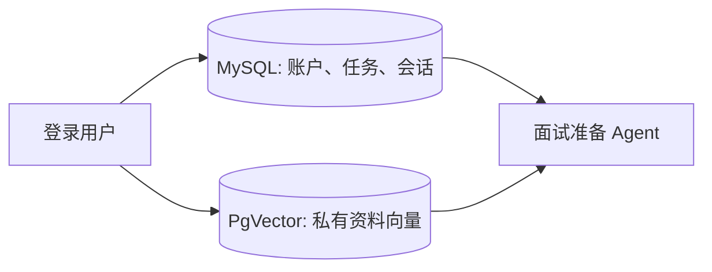

# 08 - 面试准备智能体：双库基础设施与安全边界

## 要解决的问题

原项目的 RAG 只在启动时把固定 Markdown 加载到内存中，重启后无法保留用户资料，也无法隔离不同用户的数据。与此同时，通用 Agent 默认拥有文件、下载和网页抓取能力，超出了面试准备场景的需要。

## 数据与配置

- MySQL 是主数据源，保存资料元数据、学习计划、面试记录和运行审计。
- PostgreSQL + PgVector 是第二数据源，只保存文档向量；`VectorDataSourceConfig` 用独立 `JdbcTemplate` 避免 PgVector 错连到 MySQL。
- `V2__interview_preparation_foundation.sql` 定义后续功能需要的业务表和索引，Flyway 使用基线版本 1 兼容已有的手工初始化库。
- Docker Compose 增加 `pgvector` 健康检查，后端只有在 MySQL、Redis、PgVector 均就绪后启动。
- 本地未启动 PgVector 时保持 `VECTOR_ENABLED=false`，现有聊天和单元测试仍可运行；Docker 后端会显式启用该开关。

## 安全设计

`ToolRegistration` 在第一阶段返回空工具数组。后续资料检索工具由服务端注入当前 Session 用户，不接受模型传入的用户 ID；计划工具先生成草稿，确认接口才允许写入正式数据。

## 验证方式

1. `docker compose config` 检查 PgVector 服务与变量替换。
2. 启动空 MySQL 后确认 Flyway 执行 V2，并检查业务表和索引。
3. 启动后端确认 `userKnowledgeVectorStore` 使用 PostgreSQL 连接，而主 MyBatis 数据源仍指向 MySQL。

## 常见问题

- **为什么不用一个 PostgreSQL？** 现有 MySQL 账户和会话代码无需迁移，向量检索独立扩容和维护。
- **为什么先关闭所有工具？** 面试准备的核心是私有资料与任务，不需要模型操作操作系统；最小权限比“工具多”更重要。
- **为什么还有 SimpleVectorStore？** 旧恋爱 Demo 暂时保留兼容，新的用户资料只使用 PgVector。

## 面试追问

1. 双数据源如何避免事务混用？答：资料元数据与向量写入分别有可恢复状态，先保存处理状态，再写向量，失败时记录原因并允许重试。
2. 为什么 PgVector 选 HNSW？答：适合中小规模向量的近似最近邻检索，查询延迟低，且和 PostgreSQL 运维整合。
3. 为什么不用模型传入 `userId`？答：模型输出不可信，身份只能由服务端登录态派生。
