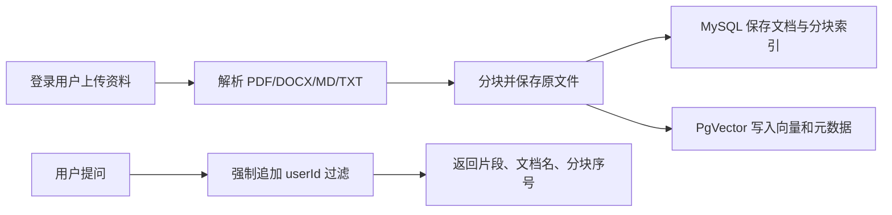

# 私有资料库与 RAG

## 要解决的问题与用户流程

简历、JD 和复习笔记原本散落在本地，聊天模型既不了解候选人的真实经历，也无法给出可核查的结论。本功能把资料变成**按用户隔离、可追溯检索**的知识库。

## 数据模型、接口和状态

`knowledge_document` 保存文档归属、类型、原文和状态；`knowledge_chunk` 保存每块文字以及向量文档 ID。上传状态为 `PROCESSING -> READY`，解析或向量写入失败时为 `FAILED`，并保留有限长度的错误信息。

| 接口 | 说明 |
| --- | --- |
| `POST /api/knowledge/documents` | 上传 `file` 和 `type` |
| `GET /api/knowledge/documents` | 只列出当前用户资料 |
| `GET /api/knowledge/documents/search` | 在当前用户范围检索并返回引用 |
| `DELETE /api/knowledge/documents/{id}` | 删除当前用户的文件、索引和向量 |

## 关键设计选择

- 向量记录额外写入 `userId`，每次相似度检索都由服务端拼接过滤表达式；前端不能传入用户 ID。
- MySQL 负责业务状态和删除授权，PgVector 只负责语义召回，避免将权限判断交给向量库。
- 使用 800 字符窗口与 120 字符重叠，优先在句末或空格处分割，兼顾中文资料的上下文连续性与召回粒度。
- 未直接把文件内容传给模型：先检索，再由后续工作流选择少量引用，降低隐私暴露与 token 消耗。

没有采用共享公共向量库加前端过滤的方案，因为任何漏传过滤条件都会造成跨用户资料泄露；也没有采用异步队列 MVP，因为当前同步上传能准确给出 `READY/FAILED` 状态，后续可以把同一状态机迁到任务队列。

## 代码入口与调用链

- `KnowledgeDocumentController` 获取 Session 登录用户，再调用 `KnowledgeDocumentService`。
- `KnowledgeDocumentServiceImpl.upload` 校验文件名，调用 `KnowledgeTextExtractor` 解析、`KnowledgeTextChunker` 分块，随后写 MySQL、文件目录和 `userKnowledgeVectorStore`。
- `search` 在 `SearchRequest` 中固定追加 `userId == 当前用户`，并把向量元数据还原为可定位的文档引用。
- Vue 的 `KnowledgeView` 展示上传状态、文档列表和命中片段；首页默认进入该工作台。

## 测试、常见错误与排查

`KnowledgeTextChunkerTest` 覆盖短文本和长文本分块边界；`MyAiAgentApplicationTests` 验证 Spring 配置与 MySQL 迁移能启动；前端使用 `npm run build` 校验页面编译。

- 上传后提示向量库未启用：检查 `VECTOR_ENABLED=true`、`VECTOR_DB_*` 环境变量及 Docker PgVector 服务健康状态。
- PDF 没有可检索文字：该 PDF 可能是扫描件；当前 MVP 不做 OCR，应先转为可复制文字或补充 OCR 管道。
- 检索为空：确认文档状态为 `READY`，再检查模型 embedding 配置与相似度阈值。
- 删除后仍出现结果：检查 PgVector 连接和 `knowledge_chunk.vector_document_id` 是否成功同步删除。

## 面试追问

1. **为什么 MySQL 和向量库要同时保存？** MySQL 适合强一致的授权、状态和列表查询；向量库只解决相似度检索，两者职责不同。
2. **如何防止 RAG 越权？** 文档 ID 查询和向量检索都以服务端 Session 用户为边界，向量元数据带 `userId`，检索条件强制注入。
3. **分块参数如何确定？** 先以资料类型和模型上下文为约束，用离线评测观察命中质量；800/120 是可配置的 MVP 起点，不是固定真理。
4. **向量写入失败怎么办？** 文档状态落为 `FAILED`，保留原因，用户可以重新上传；不把失败资料标成可检索。
5. **为什么搜索结果返回分块号？** 让分析结果能定位到具体资料片段，用户可以核查证据而不是盲信模型。
