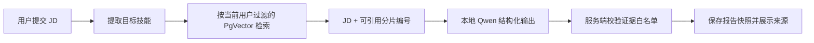

# 检索增强的能力差距分析

## 要解决的问题

JD 中写了很多技术要求，但“简历没有写到”不等于“候选人不会”。本功能把结论拆成三种：`MATCHED`（资料直接证明）、`GAP`（资料证据显示能力仍需补强）和 `UNVERIFIED`（当前资料不足，不能下结论）。

## 数据流与接口

- 继续使用 `POST /api/gap-analyses` 和 `GET /api/gap-analyses`，不允许前端指定用户 ID。
- `GapAnalysisVO.GapItem` 新增 `verdict` 与 `evidenceAvailable`。证据含资料 ID、文件名、分片序号和正文，可跳转资料库核对。
- 每个技能检索至多 4 个分片；向量检索永远附加当前登录用户的元数据过滤。
- 模型只能返回提示词给出的 `E1`、`E2` 等编号。服务端拒绝未知编号、错误技能、空建议、错误枚举和没有引用的 MATCHED/GAP 结论。

## 关键设计

- 使用本地 `qwen3:4b`，可由 `OLLAMA_CHAT_MODEL` 切换；模型调用失败或连续两次格式不合法时直接返回可重试错误，不保存半成品报告。
- JSON 解析采用“提取 JSON 对象 + Jackson 反序列化 + 业务白名单校验”三层约束。模型 JSON 合法不代表业务结果可信。
- 不采用“把整份简历交给模型”的方案：它扩大上下文和隐私暴露，也无法让用户复核每个结论。

## 代码入口

- `LocalStructuredAiClient` 负责同步模型调用、一次格式修复重试和 JSON 解析。
- `GapAnalysisServiceImpl` 负责每项技能检索、构造受限提示词、验证引用并持久化快照。
- `AnalysisView` 将结论按状态显示，并通过查询参数跳转资料库展开对应分片。

## 测试与排查

- 覆盖无资料时的 `UNVERIFIED` 降级、有引用的模型结论写入、Mapper 持久化与前端生产构建。
- 报“本地模型不可用”：检查 Ollama 服务和 `OLLAMA_CHAT_MODEL` 是否已下载。
- 报“结构化结果不可验证”：查看模型输出是否引用了不存在的 `E` 编号；此时系统不会保存报告，修复模型或重试即可。
- 检索为空：先在资料库页面检索同一技能，确认文档状态为 `READY` 且 PgVector 已启用。

## 面试追问

1. 为什么向量命中为空时不直接判为差距？答：检索召回不足不能证明用户没有能力，因此必须降级为证据不足。
2. 如何防止模型伪造引用？答：模型只看到有限编号，后端再校验编号、技能范围和当前用户归属。
3. 为什么保存报告快照？答：资料会更新，快照能解释当时的结论并给学习计划稳定的输入。
4. 本地小模型结构化输出不稳怎么办？答：限制 schema、校验后修复一次，仍失败就显式报错，不能用编造结果兜底。
