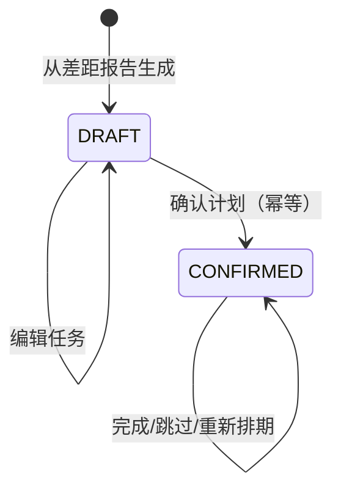

# 学习计划草稿与确认

## 问题与流程

差距报告本身不能帮助执行。本功能将一份报告转换为 7 天可编辑草稿，用户确认后才写入日期；重复点击确认不会重复创建任务或改变既有排期。

## 数据、接口与状态

`study_plan` 关联 `gap_analysis`，状态为 `DRAFT` 或 `CONFIRMED`；`study_task` 记录第几天、任务文本、日期与 `TODO/DONE/SKIPPED`。迁移 V3 增加草稿说明字段。

| 接口 | 用途 |
| --- | --- |
| `POST /api/study-plans/drafts` | 从指定差距报告生成 7 天草稿 |
| `POST /api/study-plans/{id}/confirm` | 确认并首次写入日期 |
| `PUT /api/study-plans/{id}/tasks/{taskId}` | 编辑、完成、跳过或重新排期 |
| `GET /api/study-plans` | 查看当前用户计划 |

## 关键设计

- 计划引用**报告快照 ID**，而不是重新计算差距，确保学习任务的来源可复盘。
- 首次确认才按 `DayNumber` 设置日期；后续确认检测到非 `DRAFT` 直接返回当前状态，满足幂等。
- 任务更新同时验证 `planId + taskId + userId`，避免通过猜测任务 ID 越权修改。
- 草稿无缺口时仍提供项目复盘、基础、模拟面试的 7 天基线，避免空计划。

未采用“生成即确认”：用户需要先删改不适合的任务。也没有在前端计算日期，保证服务端状态为唯一事实来源。

## 代码入口

- `StudyPlanController` 将 Session 用户传给服务层。
- `StudyPlanServiceImpl.createDraft` 读取该用户报告 JSON，按缺口循环生成 7 个任务。
- `confirm` 只在 `DRAFT` 时转状态和排期；`updateTask` 对任务归属做三重约束。
- `StudyPlanView` 选择报告、生成草稿、确认计划和更新任务状态。

## 测试与排查

应用上下文测试会执行 V3 迁移。手工回归应覆盖两次确认同一计划、用另一用户任务 ID 更新、将状态切换到 `DONE/SKIPPED`、修改日期。

- 草稿创建失败：确认差距报告属于当前用户且历史 JSON 可解析。
- 任务没有日期：计划可能仍处于 `DRAFT`，确认后会一次性排期。
- 二次确认改变日期：检查确认逻辑只在 `DRAFT` 分支写日期。

## 面试追问

1. **幂等如何实现？** 用持久化状态守卫，只允许 `DRAFT -> CONFIRMED` 发生一次；重复请求读取现有计划。
2. **为什么不直接用日期当主键？** 同一天可能多个任务，且用户会重新排期，稳定的任务 ID 更合适。
3. **怎样保证编辑不越权？** 每次更新查询同时包含任务、计划和 Session 用户 ID。
4. **计划如何适配分析更新？** 创建新的草稿绑定新的分析快照，历史已确认计划不被覆盖。
