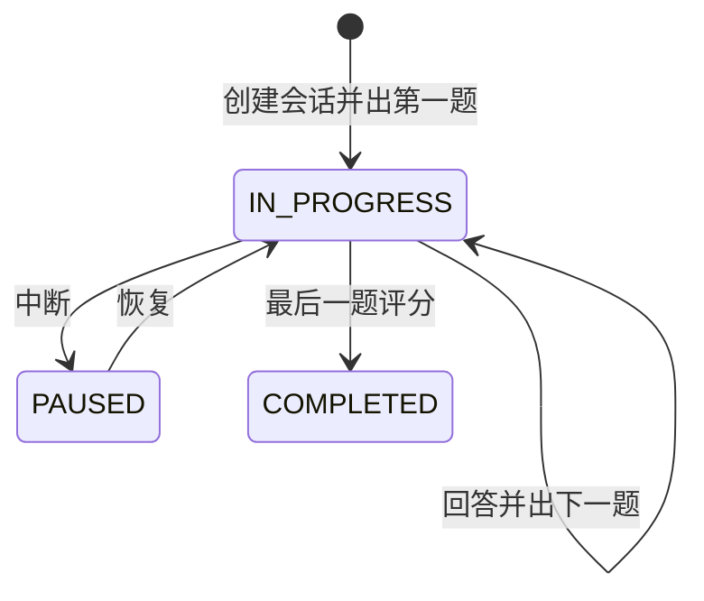

# 状态化模拟面试

## 流程

## 数据与接口
`interview_session` 保存用户、主题、题数和状态；`interview_turn` 逐题保存问题、回答、评分和反馈。`POST /api/interviews` 创建，`POST /{id}/answers` 答题，`pause/resume` 中断恢复，`GET` 读取历史。所有会话读取均以 Session 用户过滤。

## 设计
- 会话和轮次都持久化，刷新或断线后能恢复到 `ASKED` 的当前题。
- 评分是可替换的 MVP 策略：目前按回答长度给结构化反馈，后续可改为模型评分且保留同一状态机。
- 同时修复旧的 `/conversations/{id}/messages`：查询消息前先验证会话归属，阻断 IDOR 越权。

## 代码与排查
`InterviewController -> InterviewServiceImpl -> session/turn Mapper`；`answer` 事务内写回答、反馈并决定下一题或完成。若无法继续答题，检查会话是否 `PAUSED/COMPLETED` 和是否存在 `ASKED` 轮次。

## 面试追问
1. **为什么是状态机？** 中断恢复、重复请求和完成边界需要显式状态，不能只依赖前端页面。
2. **如何防越权？** 查询 session 时强制同时匹配 ID 和 Session 用户 ID；轮次通过已授权会话访问。
3. **如何替换评分模型？** 将 `score/feedback` 的计算提取为策略，状态写入逻辑不变。
