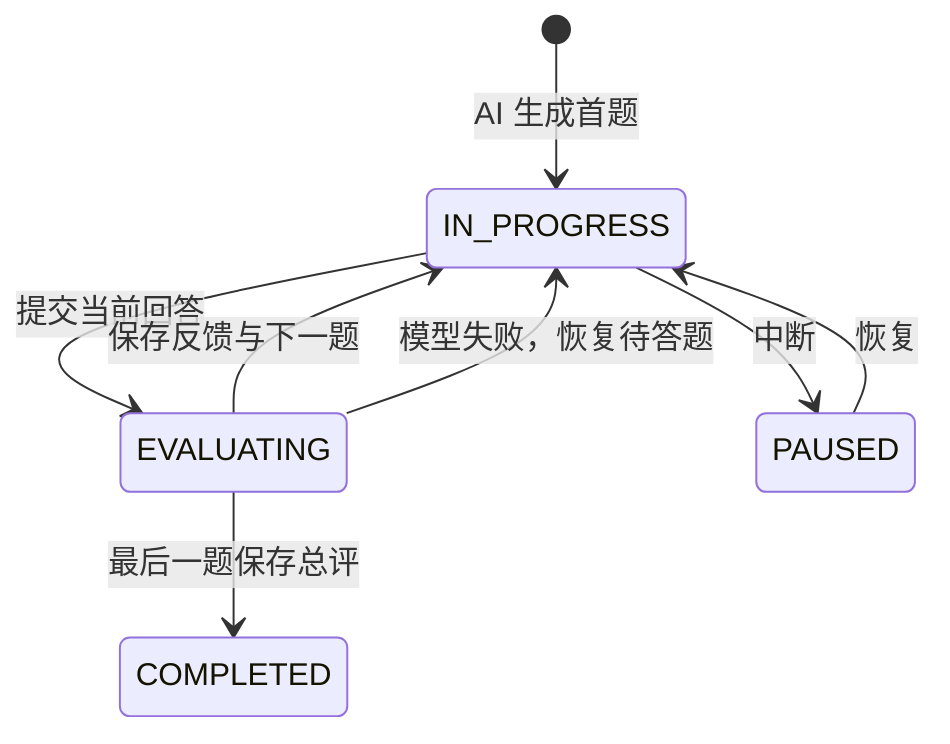

# AI 状态化模拟面试

## 要解决的问题

固定题库和“回答越长分越高”不能模拟真实面试。本功能使用本地模型根据面试主题和私有资料生成首题；每次回答后给出结构化点评、补弱任务以及下一题或追问。

## 数据模型与接口

- `interview_session` 保存用户、主题、题数和会话状态；所有查询都同时按 session ID 与当前用户 ID 过滤。
- `interview_turn` 新增 `question_context`、`feedback_detail` 和 `evidence_detail`。结构化评分、优点、缺失要点、补弱任务与资料来源在刷新后仍能回放。
- 保持 `POST /api/interviews`、`POST /api/interviews/{id}/answers`、`pause`、`resume` 与查询接口不变；响应的 `Turn` 增加评分详情和引用资料。
- `ASKED -> EVALUATING -> ANSWERED` 阻止重复提交。模型失败时将当前轮恢复为 `ASKED`，用户能直接重试。

## 关键设计

- 复用 `LocalStructuredAiClient`：本地模型只返回 JSON，解析与字段校验失败时修复一次，仍失败则明确返回错误。
- 首题和评分都把当前用户的检索分片作为参考；没有资料时提示模型不能臆测候选人经历。
- 不在数据库事务中等待模型响应，避免把长时间的本地推理锁住业务连接。中间 `EVALUATING` 状态负责并发保护。
- 最后一题不生成下一题，直接把会话转为 `COMPLETED`；评分中不允许暂停。

## 代码入口与排查

- `InterviewServiceImpl` 组织检索、提示词、状态迁移和持久化；`AiInterviewResponse` 是模型的受限数据契约。
- `InterviewView` 展示题目考察点、评分、优缺点、补弱任务和资料入口。
- 首题无法生成：确认 Ollama 已启动且 `OLLAMA_CHAT_MODEL` 对应模型已下载。
- 提交后提示失败：本题会恢复到待答状态；不要刷新前端来重复提交，直接检查模型后重试。
- 数据库列不存在：运行应用让 Flyway 执行 `V4__add_interview_ai_feedback.sql`，再检查 `flyway_schema_history`。

## 测试与面试追问

- 单测覆盖首题生成、评分推进到下一题、模型失败恢复待答状态和实体列映射；应用上下文测试验证 Flyway 可升级现有库。
1. 为什么需要 `EVALUATING`？答：它是重复提交和中断竞态的业务锁，不依赖前端按钮禁用。
2. 为什么不根据回答字数评分？答：字数不是正确性；模型按预设字段评价完整性、原理、案例和边界条件。
3. 如何保证会话恢复？答：每个问题、答案、反馈 JSON 和引用都写入 MySQL，页面只读取持久化状态。
4. 模型胡乱输出怎么办？答：结构化解析和字段校验失败时重试一次，仍失败不写入伪反馈，并把本题恢复为可重答。
