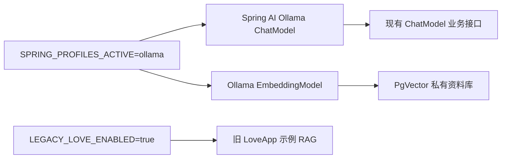

# 本地 Ollama 模型切换

## 目标与流程

DashScope 免费额度用尽后，应用不应因为旧示例 RAG 在启动阶段请求 embedding 而完全不可用。本功能新增 `ollama` Profile，让聊天与私有资料向量检索都在本机完成。



## 配置

安装 Ollama 后执行：

```powershell
ollama pull qwen3:4b
ollama pull bge-m3
$env:SPRING_PROFILES_ACTIVE = 'ollama'
.\mvnw.cmd spring-boot:run
```

默认聊天模型是 `qwen3:4b`，可用 `OLLAMA_CHAT_MODEL` 覆盖；默认 embedding 是 `bge-m3`，可用 `OLLAMA_EMBEDDING_MODEL` 覆盖。`bge-m3` 与当前 PgVector 的 1024 维设置匹配；若更换为不同维度的 embedding 模型，必须新建或重建向量库。

## 设计

- `ChatModel` / `EmbeddingModel` 是 Spring AI 的跨提供商抽象，因此业务服务不绑定 DashScope SDK。
- `application-ollama.yaml` 选择 Ollama 的聊天与 embedding 自动配置，并停用 DashScope 对应模型。
- 旧 `LoveApp` 的 SimpleVectorStore、云端 RAG 加 `app.legacy-love.enabled` 开关，默认不启动，不再消耗模型额度。
- 云端 DashScope profile 保留，设置 API Key 和模型名后仍可恢复。

## 测试与排查

- `ollama list` 确认本地模型已下载；`ollama serve` 默认监听 `http://localhost:11434`。
- 用 `OLLAMA_BASE_URL` 指向非默认 Ollama 地址。
- 启动报向量维度错误时，删除开发期向量库数据并按新的 embedding 模型重新上传资料。
- 本地模型首次响应慢属于加载模型；可调整模型大小或提高内存/显存。

## 面试追问

1. **为什么聊天和 embedding 要分开配置？** 两者承担不同任务，embedding 维度还决定向量表兼容性。
2. **如何无代码切换模型？** 把 provider-specific 属性放在 Profile，业务层只注入 Spring AI 抽象。
3. **如何避免旧模块拖垮启动？** 使用条件化配置，只有显式启用才初始化有外部调用的示例 bean。
