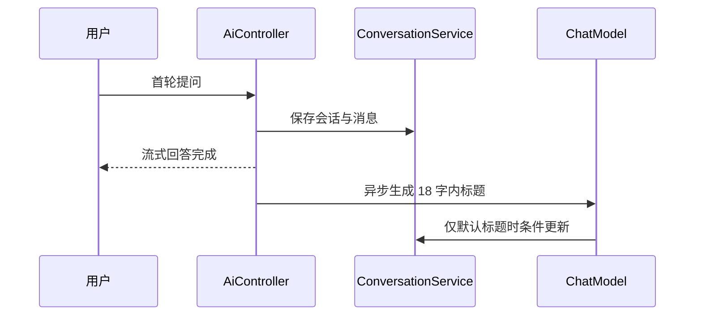

# AI 会话标题

## 问题与流程

手工创建的会话默认叫“新对话”，难以从历史列表中定位内容。首轮消息完成后，系统异步调用当前启用的 `ChatModel` 生成短标题。

## 设计

- 使用通用 `ChatModel`，因此 DashScope / Ollama 切换无需改标题逻辑。
- `@Async` 防止标题生成延长用户首轮回答时间。
- SQL 更新包含 `title = 新对话` 条件，用户手动编辑后异步结果不会覆盖它。
- 失败仅记录日志，会话仍保留默认标题。

## 代码与测试

`AiController` 在 Manus 首轮完成后调用 `ConversationTitleService`；服务负责模型请求、标题清洗与条件更新。`ConversationTitleServiceTest` 覆盖换行、引号、空结果和 18 字截断。

## 面试追问

1. **为什么异步？** 标题不是主链路结果，延迟或失败不应该影响聊天响应。
2. **如何防覆盖手动标题？** 用数据库条件更新而非先查后写，避免并发竞争。
3. **模型失败怎么办？** 保留默认标题并记录可观测日志，后续可重试。
